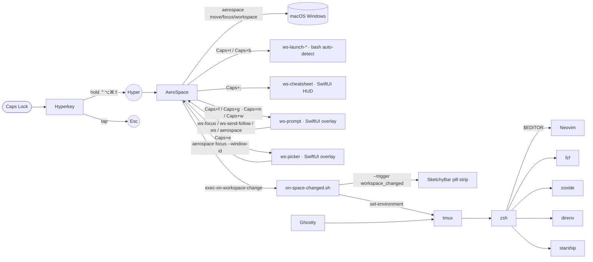

# Architecture

> For chord lookups, file:line pointers, and collision rules, see
> [keymap.md](keymap.md).

> **Migration history (yabai → AeroSpace, Karabiner → Hyperkey).** Plan at
> [~/.claude/plans/let-s-migrate-to-aerospace-structured-bunny.md](../../../.claude/plans/let-s-migrate-to-aerospace-structured-bunny.md).
> The migration shipped in 7 phases; the rest of this document describes
> the current state. The three contracts below are still the canonical
> reference for the data flow between sigil, aerospace, and the
> environment.
>
> 1. **`current.env`** renames `MACOS_SPACE_INDEX` → `MACOS_WORKSPACE_NAME`.
>    Out-of-repo consumers (tmux.conf, starship.toml) only read `_NAME`,
>    `_COLOR`, `_ICON`, `_ANSI` — no breakage. Same field set otherwise.
> 2. **`~/.config/aerospace/aerospace.toml`** is sentinel-fenced. User owns
>    everything except the block between `# >>> sigil generated >>>` and
>    `# <<< sigil generated <<<`. That block carries per-workspace digit
>    bindings. The `exec-on-workspace-change` cascade hook (which primes
>    `current.env`) sits in the user-owned top section as a top-level
>    key. Written atomically by `ws-topology emit-aerospace`, validated
>    before write. Hand-edits inside the fence are clobbered.
> 3. **`spaces.json` v3** keys on `"<displayUUID>:<workspaceName>"`.
>    `displayUUID` from `CGDisplayCreateUUIDFromDisplayID` (stable; AeroSpace
>    monitor ordinals are not). v3 is the only supported schema —
>    `ws-topology migrate` rejects anything else.

Caps Lock is king of the dev surface.

## Layer stack

Hyperkey intercepts Caps Lock and re-emits `Escape` (on tap) or the
4-modifier Hyper combo (on hold). **AeroSpace** consumes each
`cmd-alt-ctrl-shift-*` chord — it both tiles windows AND dispatches the
chord to the right action (focus / move / launch / overlay). Workspace
overlays are small Swift binaries (**ws-prompt**, **ws-picker**,
**ws-cheatsheet**, **ws-snap**) that capture the AX surface for
keystroke-driven workflows. Inside the terminal, **tmux** + **zsh** +
**Neovim** form the dev surface — every layer reusing the same
vim-style hjkl + leader-key mental model.

## The single Hyper layer

| User presses | Hyperkey emits | Modifier set |
|---|---|---|
| Caps Lock alone (tap) | `Escape` | — |
| Caps Lock held | **Hyper** | `⌃⌥⌘⇧` (4) |

One layer. Hyperkey remaps the Caps Lock key itself, not "Caps +
modifier" combinations, so there's no way to disambiguate Caps+Shift
from plain Caps at the chord layer — swap chords live on
**Caps + y/u/i/o**, not on Caps+Shift+hjkl. (Background on the
two-layer setup we used to run lives in
`docs/archive/yabai-to-aerospace.md`.)

### Hyper governs the OS-level chord vocabulary

| Concern | Examples |
|---|---|
| Navigate | focus neighbour (`hjkl` tiled), snap float (`hjkl` floating), change workspace (`e`), focus workspace (`f`), cycle workspace (`n`/`p`/`tab`) |
| Modify | swap window (`yuio` — was `Shift+hjkl` pre-Hyperkey), toggle float (`v`), rotate space (`r`), go / send window (`g`/`m`), edit workspace (`w`) |
| Launch | terminal (`t`), browser (`b`), Finder (`o`), settings (`,`), notes (`q`), inbox (`x` — was `Shift+q` pre-Hyperkey), cheatsheet (`;`) |

All workspace operations go through `ws-prompt` and `ws-picker` —
one-shot SwiftUI overlays that capture keystrokes themselves and exit
on commit / cancel / blur / Esc; aerospace never holds workspace state.
Four overlays, one pattern: **digit commits · letters fuzzy-search ·
↵ accepts · esc cancels** — pick by intent.

| Trigger | Prompt | What |
|---|---|---|
| `Caps + e`         | change workspace | `ws-picker` — fuzzy-search every window in every space; ↵ jumps to that window's space |
| `Caps + f`         | focus workspace  | digit (1..0) commits instantly · letters fuzzy-match name + Enter |
| `Caps + g`  ·  `Caps + m` | go (send window) | digit commits + follow · letters fuzzy-match name + Enter (`m` is an alias — "move" mnemonic) |
| `Caps + w`         | edit workspace | verb-picker: `a` add · `r` rename · `i` icon · `d` destroy · `⇧L` layout · `v` verify · `?` doctor |

The edit overlay is a multi-stage state machine (verb → target /
payload → confirm → result). Commits shell straight out to the `ws`
CLI and aerospace; stdout + stderr surface in an in-overlay result
panel. Names are constrained to start with a non-digit (enforced by
`ws name`/`ws add`) so an all-numeric query unambiguously addresses a
slot index — the path to slot 11+ via numeric input. **Add/destroy
verbs surface a help message** rather than mutate — under aerospace,
workspace existence is config-time (edit `aerospace.toml` + reload).

AeroSpace's `[[on-window-detected]]` rules pick float-vs-tile by
bundle ID at window-open time; `Caps+v` toggles the focused window
between the two modes manually. Window staging is config-time, not
hook-time — AeroSpace's declarative layout tree handles placement.

## Who owns what

| Concern | Owner | Config |
|---|---|---|
| Caps remap | Hyperkey | (user defaults — `com.knollsoft.Hyperkey`) |
| Window tiling (i3-style, gaps, rules) | AeroSpace | `aerospace.toml` |
| Hyper chord dispatch | AeroSpace | `aerospace.toml` `[mode.main.binding]` |
| Workspace focus / send / edit overlays | ws-prompt (SwiftUI; edit = multi-stage state machine over `ws`) | [sigil](https://github.com/adames/sigil)/Sources/ws-prompt/ |
| Change-workspace overlay (Caps+e) | ws-picker (SwiftUI; fuzzy-search every window in every space, ↵ jumps to its space) | [sigil](https://github.com/adames/sigil)/Sources/ws-picker/ |
| AX absolute-snap CLI (manual use) | ws-snap | [sigil](https://github.com/adames/sigil)/Sources/ws-snap/ |
| Cheatsheet HUD | ws-cheatsheet | `configs/workspace/cheatsheet.json` + [sigil](https://github.com/adames/sigil)/Sources/ws-cheatsheet/ |
| Cross-display topology (notch + per-display layout) | ws-topologyd (LaunchAgent) | [sigil](https://github.com/adames/sigil)/Sources/ws-topologyd/ |
| Workspace pill strip | ws-statusbar (NSStatusItem) | [sigil](https://github.com/adames/sigil)/Sources/ws-statusbar/ |
| Terminal · tmux · zsh · nvim | Ghostty + tmux + zsh + Neovim/Mason | respective configs |

## Why AeroSpace plus small Swift CLIs?

**AeroSpace** consumes Hyper chords directly — it has a built-in
keybinding engine and runs entirely in userspace. Each
`[mode.main.binding]` entry maps a chord to an `exec-and-forget` or a
native command like `workspace`, `focus`, `move`. Anything that needs
macOS API access beyond what aerospace covers is its own one-shot
binary, shipped by the Swift package in the
[sigil](https://github.com/adames/sigil) repo (cloned to
`~/.config/workspace/` by bootstrap):

- **ws-prompt** — SwiftUI overlay for Caps+f (focus workspace) / Caps+g · Caps+m
  (go / send window) / Caps+w (edit workspace). Captures keys itself;
  exits on commit / cancel / blur. Edit is a multi-stage state
  machine that shells out to `ws` and aerospace and surfaces captured
  output in a result panel. Under aerospace, add/destroy verbs route to
  a help-text result panel rather than mutate runtime — workspace
  existence is config-time.
- **ws-picker** — SwiftUI window picker (Caps+e — the "change workspace"
  prompt). Lists every visible aerospace window across every workspace,
  fuzzy-filters by app + title + workspace; focusing the pick implicitly
  jumps to that window's workspace (aerospace follows the focus). Same
  overlay shape as ws-prompt — they share the WsUI design tokens
  (Catppuccin palette, pill geometry, fuzzy matcher).
- **ws-cheatsheet** — SwiftUI HUD (Caps+;). Single-instance toggle
  via PID file.
- **ws-snap** — AX-based absolute snap CLI for floating windows.
  Invoked by `ws-dir` from Caps+h/j/k/l when the focused window is
  floating (h=left, l=right, j=center, k=max).
- **ws-statusbar** — NSStatusItem menu-bar item that draws the
  workspace pill row and provides a dropdown menu for direct workspace
  switching. Reads spaces.json for identity (name/icon/color), joins
  it against aerospace's live workspace list.
- **ws-topologyd** — LaunchAgent that watches display reconfig (via
  `CGDisplayRegisterReconfigurationCallback`) and publishes
  topology.json + layout.env to `~/.cache/workspace/`. Notifies
  ws-statusbar to repaint via `DistributedNotification`.

Pure userspace — no DriverKit kext, no scripting addition, no SIP
modification, no Lua runtime.

## In-terminal layers

Once you're in the terminal the same hjkl + leader-key model continues:

| Layer | Prefix / leader | Owns |
|---|---|---|
| **tmux**   | `Caps+␣` (via AeroSpace → `C-Space`) | Pane focus (`hjkl`), splits (`v`/`s`), zoom (`z`), sessionizer (`f`), windows (`c`/`n`/`p`/`0..9`) |
| **zsh**    | (vi-mode `Esc`) | Vi normal-mode editing on the command line; fzf widgets `Ctrl-R/T`/`Alt-C`; zoxide `z` |
| **Neovim** | `Space`         | LSP (`gd`/`K`/`gr`/`<leader>ca`/`<leader>rn`), find (`<leader>f*`), debug (`<leader>d*`), test (`<leader>t*`) |

Modifier sets the scope: bare `h` moves the cursor in vim, `Caps+␣  h`
moves the tmux pane focus, `Caps + h` moves the OS window focus. Same
letter, four contexts, no overlap.

## Python dev path

After bootstrap, open any `.py` file in nvim. **Pyright** (types,
definitions, hover) and **Ruff** (lint, format) attach. Save → Ruff
auto-formats via `BufWritePre`. `<leader>tn` runs the nearest test;
`<leader>td` runs it under debugpy; `<leader>ts` toggles the neotest
summary. Servers come from Mason / mason-tool-installer, pinned via
`lazy-lock.json`.

## Permission gates

| Permission | Apps | Wizard pane |
|---|---|---|
| Accessibility | AeroSpace · Hyperkey · ws-snap | `Privacy_Accessibility` |
| sudo (one-shot) | brew cask `installer -pkg` | `sudo -v` at start |

The wizard opens the pane and waits for ↵. One pane, ~30 seconds total.
Probes first via [`lib/macos-tcc.sh`](../lib/macos-tcc.sh) so a working
machine finishes in ~2 seconds. See [`wizard.md`](wizard.md).

## Workspace system

Workspace overlays and management come from **[Sigil](https://github.com/adames/sigil)** — see its README for the full cascade architecture.

**Integration point:** AeroSpace provides workspace existence (declared
in `aerospace.toml`); Sigil provides optional identity (name, color,
icon) in `spaces.json`, overlays (`ws-prompt`, `ws-picker`,
`ws-cheatsheet`), and the pill row (`ws-statusbar`). The dotfiles
configure aerospace's `[mode.main.binding]` to dispatch chords to
these surfaces. `exec-on-workspace-change` writes
`~/.cache/workspace/current.env` and ws-statusbar repaints from the
`DistributedNotification` ws-topologyd fires on display reconfig.

## Pill strip ↔ macOS menu bar

ws-statusbar is a regular NSStatusItem — it lives in the macOS menu
bar alongside system icons, so there's no spatial conflict to manage.
`outer.top = 26` in `aerospace.toml` reserves the menu-bar strip from
tiled windows. Notch detection comes from `ws-topologyd` reading
`NSScreen.safeAreaInsets` and capping visible slots on built-in
notched displays; the cap is published as `WS_MAX_VISIBLE_SLOTS_<id>`
in `~/.cache/workspace/layout.env` for any consumer that needs it.
