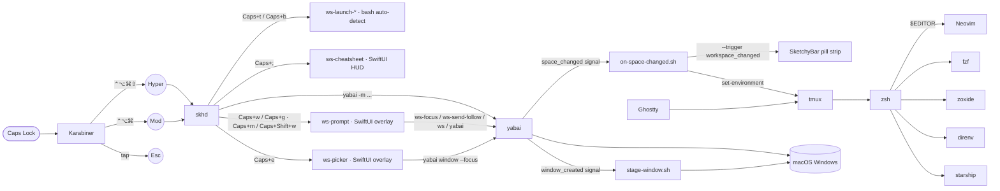
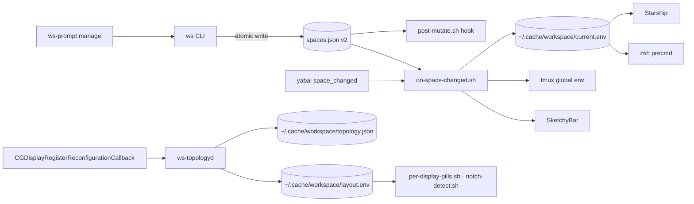

# Architecture

> For chord lookups, file:line pointers, and collision rules, see
> [keymap.md](keymap.md). This doc is the narrative and rationale.

Caps Lock is king of the dev surface.

## Layer stack

Karabiner intercepts Caps Lock and re-emits one of three things
depending on what's held with it. **skhd** dispatches each Hyper/Mod
chord to **yabai** (for tiling) or to a small Swift binary
(**ws-prompt**, **ws-cheatsheet**, **ws-snap**) where logic is needed.
Inside the terminal, **tmux** + **zsh** + **Neovim** form the dev
surface — every layer reusing the same vim-style hjkl + leader-key
mental model.

## The two Hyper levels

| User presses | Karabiner emits | Modifier set |
|---|---|---|
| Caps Lock alone (tap) | `Escape` | — |
| Caps Lock held | **Hyper** | `⌃⌥⌘⇧` (4) |
| Caps Lock + Shift held | **Mod** | `⌃⌥⌘` (3, Shift consumed) |

Why two levels: if Hyper contained Shift, `Hyper + Shift + H` would
collapse to `Hyper + H` — indistinguishable. By making `Caps + Shift`
emit a *different* combo (Mod), skhd binds them as separate chords.
JSON specifics in [`configs/karabiner.md`](../configs/karabiner.md).

### Hyper = navigate, Mod = modify

| Layer | Role | Examples |
|---|---|---|
| **Hyper** | navigate / read-only | focus window (`hjkl`), focus workspace (`w`), send window (`g` / `m`), cycle workspace (`n`/`p`/`tab`), window picker (`e`), open app (`t`/`b`/`o`/`,`/`q`), cheatsheet (`;`) |
| **Mod**   | modify / destructive | swap window (`hjkl`), manage workspace (`w`), rebalance (`r`), center float (`v`), inbox (`q`) |

All workspace operations go through `ws-prompt`, a one-shot SwiftUI
overlay that captures keystrokes itself and exits on
commit / cancel / blur / Esc — skhd never holds workspace state:

| Trigger | Prompt | What |
|---|---|---|
| `Caps + w`         | focus  | digit (1..0) commits instantly · letters fuzzy-match name + Enter |
| `Caps + g`  ·  `Caps + m` | go (move) | digit commits + follow · letters fuzzy-match name + Enter (`m` is an alias — "move" mnemonic) |
| `Caps + Shift + w` | manage | verb-picker: `a` add · `r` rename · `i` icon · `d` destroy · `⇧L` layout · `v` verify · `?` doctor |

The manage overlay is a multi-stage state machine (verb → target /
payload → confirm → result). Commits shell straight out to the `ws`
CLI and yabai; stdout + stderr surface in an in-overlay result panel.
Names are constrained to start with a non-digit (enforced by `ws
name`/`ws add`) so an all-numeric query unambiguously addresses a
slot index — the path to slot 11+ via numeric input.

New windows are auto-staged centered on the focused space by yabai's
`window_created` signal
([stage-window.sh](../configs/workspace/stage-window.sh)). Tile-vs-float
is the app/rule decision; staging just centers + focuses, and `Caps+v`
toggles float to commit a staged window into the BSP tiling.

## Who owns what

| Concern | Owner | Config |
|---|---|---|
| Caps remap | Karabiner | `karabiner.json` |
| Window tiling (BSP, gaps, rules) | yabai | `yabairc` |
| Hyper/Mod hotkey dispatch | skhd | `skhdrc` |
| Workspace focus / send / manage overlays | ws-prompt (SwiftUI; manage = multi-stage state machine over `ws`) | `configs/workspace/topology/Sources/ws-prompt/` |
| Window picker overlay (Caps+e) | ws-picker (SwiftUI; fuzzy-search every visible yabai window) | `configs/workspace/topology/Sources/ws-picker/` |
| New-window staging | bash + yabai signal | `configs/workspace/stage-window.sh` |
| AX absolute-snap CLI (manual use) | ws-snap | `configs/workspace/topology/Sources/ws-snap/` |
| SketchyBar per-display autohide | ws-autohide (LaunchAgent) | `configs/workspace/topology/Sources/ws-autohide/` |
| Cheatsheet HUD | ws-cheatsheet | `configs/workspace/cheatsheet.json` + `configs/workspace/topology/Sources/ws-cheatsheet/` |
| Cross-display topology (notch + per-display layout) | ws-topologyd (LaunchAgent) | `configs/workspace/topology/` |
| Workspace pill strip | SketchyBar | `configs/sketchybar/` |
| Terminal · tmux · zsh · nvim | Ghostty + tmux + zsh + Neovim/Mason | respective configs |

## Why skhd plus small Swift CLIs?

**skhd** forwards keystrokes via `CGEventTap` — fast, stateless, but
it only knows how to fire shell commands. Anything that needs macOS
API access is its own one-shot binary, shipped by the Swift package
under `configs/workspace/topology/`:

- **ws-prompt** — SwiftUI overlay for Caps+w / Caps+g · Caps+m / Caps+Shift+w.
  Captures keys itself; exits on commit / cancel / blur. Manage is a
  multi-stage state machine that shells out to `ws` and yabai and
  surfaces captured output in a result panel.
- **ws-picker** — SwiftUI window picker (Caps+e). Lists every visible
  yabai window, fuzzy-filters by app + title + space, focuses the pick
  on Enter. Same overlay shape as ws-prompt — they share the WsUI
  design tokens (Catppuccin palette, pill geometry, fuzzy matcher).
- **ws-cheatsheet** — SwiftUI HUD (Caps+;). Single-instance toggle
  via PID file.
- **ws-snap** — AX-based absolute snap CLI for floating windows. Not
  bound to a chord; manual use only.
- **ws-autohide** — only long-running helper. LaunchAgent-managed
  cursor poller (100 ms) that hides each display's SketchyBar pills
  when the cursor approaches its top edge. Yabai display indices are
  cached and invalidated on `didChangeScreenParameters`; popup-menu
  detection is gated on the cursor being near an unhide boundary.

Smaller surface than the old skhd + Hammerspoon split — no Lua
runtime, no extra Accessibility-permissioned daemon.

## In-terminal layers

Once you're in the terminal the same hjkl + leader-key model continues:

| Layer | Prefix / leader | Owns |
|---|---|---|
| **tmux**   | `C-Space` | Pane focus (`hjkl`), splits (`v`/`s`), zoom (`z`), sessionizer (`f`), windows (`c`/`n`/`p`/`0..9`) |
| **zsh**    | (vi-mode `Esc`) | Vi normal-mode editing on the command line; fzf widgets `Ctrl-R/T`/`Alt-C`; zoxide `z` |
| **Neovim** | `Space`         | LSP (`gd`/`K`/`gr`/`<leader>ca`/`<leader>rn`), find (`<leader>f*`), debug (`<leader>d*`), test (`<leader>t*`) |

Modifier sets the scope: bare `h` moves the cursor in vim, `C-Space  h`
moves the tmux pane focus, `Caps + h` moves the OS window focus. Same
letter, four contexts, no overlap.

## Python dev path

After bootstrap, open any `.py` file in nvim. **Pyright** (types,
definitions, hover) and **Ruff** (lint, format) attach. Save → Ruff
auto-formats via `BufWritePre`. `<leader>tn` runs the nearest test;
`<leader>td` runs it under debugpy; `<leader>ts` toggles the neotest
summary. Servers come from Mason / mason-tool-installer, pinned via
`lazy-lock.json`.

## Permission gates

| Permission | Apps | Wizard pane |
|---|---|---|
| Accessibility | yabai · skhd · ws-snap · Karabiner-Elements | `Privacy_Accessibility` |
| Input Monitoring | Karabiner-Elements · Karabiner-DriverKit | `Privacy_ListenEvent` |
| System Extension approval | Karabiner-DriverKit-VirtualHIDDevice | `Privacy_SystemServices` |
| Spaces "Displays have separate Spaces" | yabai | bootstrap sets `defaults` — **logout required** |
| sudo (one-shot) | brew cask `installer -pkg` | `sudo -v` at start |

The wizard opens each pane and waits for ↵. Three panes, ~5 minutes
total. Probes first via [`lib/macos-tcc.sh`](../lib/macos-tcc.sh) so a
working machine finishes in ~2 seconds. See [`wizard.md`](wizard.md).

## Workspace identity cascade

Workspace identity (default: empty seed; slots render as bare
`ws1`, `ws2`, … until you `ws name N <name>`) is a single piece of
state — `~/.config/workspace/spaces.json` — read by five subsystems.
Mutations go through the `ws` CLI, either directly from the terminal
or via `ws-prompt manage` (which shells out to `ws` and yabai). The
CLI's atomic write fans out via the cascade.

Two parallel cache lines: `current.env` is keyed on focused space
(consumed by tmux / starship / `paint-all.sh`), and `layout.env` is
keyed on display (consumed by the sketchybar layout plugins). They
never overlap — one source per render hot path.

**Sentinel-subscriber pill rendering.** The custom `workspace_changed`
event is fired from four places — yabai's `space_changed` signal (via
`on-space-changed.sh`), sketchybarrc init, `per-display-pills.sh` (on
display events), and `ws-topologyd` (on display reconfig). All four
deliver to one hidden item (`workspace.paint`) whose `script=` points
at `plugins/paint-all.sh`. That plugin reads `spaces.json` once,
decides per-slot state (bare vs customized, active vs inactive,
digit vs dot for slots > 10), and emits one batched `sketchybar --set`
transaction for every pill + name chip. Pills themselves carry no
per-item script — a focus change is one atomic redraw, not N staggered
ones.

- **Source of truth.** `spaces.json` is per-machine, in `$HOME`,
  never committed. Bootstrap seeds it from `spaces.default.json` only
  when missing; user edits survive bootstrap re-runs. yabai owns
  EXISTENCE (which spaces, on which display); `spaces.json` layers
  optional IDENTITY (name, color, icon) on top.
- **The CLI** (`~/.local/bin/ws`; `workspace` kept as a compat
  symlink) is the public mutation API. Subcommands cover name /
  color / icon / theme / add / remove / swap / move / rotate /
  reverse / reorder / layout / edit / reset / doctor / verify.
  Every mutation is atomic (mktemp + jq + mv) and fires the cascade.
  Slot count is derived dynamically from yabai. Any subcommand that
  takes a slot accepts either a numeric index or a unique slot name.
  Workspace lifecycle is also available through the manage overlay,
  which shells out to the same CLI.
- **Positional colors.** Reordering ops (`swap`/`move`/`rotate`/
  `reverse`/`reorder`) permute only the `(name, icon)` tuples — color
  stays anchored to slot index. Muscle memory: "orange always means
  slot 2." Change a slot's color directly with `ws color N #HEX`.
- **`on-space-changed.sh`** is the cascade entry point — called by
  yabai's `space_changed` signal *and* by every CLI mutation. Writes
  `current.env` atomically, pushes env into tmux, triggers sketchybar.
  Silent-on-absence per subsystem so Ubuntu and partial setups work.
- **`hooks/post-mutate.sh`** is a user-owned extension point. The
  shipped default keeps SketchyBar's pill set in sync on
  `add` / `remove`. Receives `(subcommand, slot_indices...)` after
  every mutation. Per-machine; never clobbered.
- **Per-host overlay.** `ws host init` forks the shared `spaces.json`
  into `spaces.<hostname>.json`; cascade and CLI both prefer the host
  file when present. `ws host reset` removes the overlay.

## SketchyBar coexistence with the macOS menu bar

Layers cooperate so the pill strip shares space with the system menu
bar without replacing it, and each display gets its own per-monitor
pill set:

| Layer | Setting | Effect |
|---|---|---|
| macOS | `_HIHideMenuBar=1` | Menu bar hides by default; reveals when cursor at top |
| SketchyBar | `topmost=off`, `y_offset=7` | Strip draws behind the menu bar; vertically centered in y=0..40 |
| SketchyBar items | `display=<N>` per pill | Each pill visible only on its owning yabai display |
| yabai | `external_bar all:26:0` | BSP-tiled windows never enter the top 26px |
| ws-autohide | LaunchAgent | 100 ms cursor poller; toggles each pill's `y_offset` based on per-display cursor.y |

Result: cursor at the very top of display N → display N's pills slide
off-screen, the macOS menu bar reveals on N. Cursor elsewhere → that
display's strip stays put. Other displays are unaffected.

**Per-display pill assignment + name chip** is owned by
[`plugins/per-display-pills.sh`](../configs/sketchybar/plugins/per-display-pills.sh).
It queries yabai, sets `display=<idx>` on each pill, creates one
`workspace.name.<D>` chip per display (the always-visible "you are
here" label), and adds/removes items so the sketchybar set tracks
yabai exactly. Re-fires from yabai's `display_added` / `removed` /
`changed` signals — *not* `space_changed`, because per-pill display
assignment doesn't change on focus.

**Notch detection + visible cap.**
[`plugins/notch-detect.sh`](../configs/sketchybar/plugins/notch-detect.sh)
sources `~/.cache/workspace/layout.env`, written by `ws-topologyd`
from `NSScreen.safeAreaInsets` — the authoritative API for camera
housing geometry. On notched laptops' built-in displays, visible pills
are capped at 10 (or `WS_MAX_VISIBLE_SLOTS_<id>` when published).
Non-notched displays show all assigned pills.
