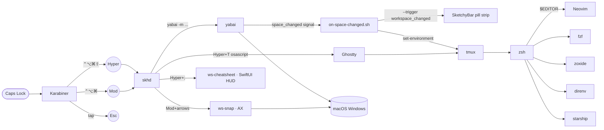

# Architecture

Caps Lock is king of the dev surface.

## Layer stack



Caps Lock is intercepted by Karabiner, which re-emits one of three things
depending on what's held with it. **skhd** listens for those re-emitted
modifier sets and dispatches each hotkey — either to **yabai** for tiling
or to a tiny Swift CLI (**ws-snap**, **ws-cheatsheet**) for the cases
where logic is required. Inside the terminal, **tmux** + **zsh** +
**Neovim** form the dev surface — every layer reusing the same vim-style
hjkl + leader-key mental model.

## The two Hyper levels

| User presses | Karabiner emits | Modifier set |
|---|---|---|
| Caps Lock alone (tap) | `Escape` | — |
| Caps Lock held | **Hyper** | `⌃⌥⌘⇧` (4) |
| Caps Lock + Shift held | **Mod** | `⌃⌥⌘` (3, Shift consumed) |

Why two levels: if Hyper itself contained Shift, then `Hyper + Shift + H`
would collapse to `Hyper + H`. By making Caps+Shift emit a *different*
combo (Mod), skhd binds them as separate shortcuts. JSON specifics in
[`configs/karabiner.md`](../configs/karabiner.md).

### Hyper = navigate, Mod = modify

The two layers carry a consistent semantic split:

| Layer | Role | Examples |
|---|---|---|
| **Hyper** | navigate / read-only | focus window (`hjkl`), focus space (`1..8`), focus display (`tab`), new terminal (`t`), launch app (`b`/`c`), cheatsheet (`0`) |
| **Mod**   | modify / destructive | swap window (`hjkl`), send-to-space (`1..8`), focus prev display (`tab`), manual snap (`arrows`) |

This is why the SIP-safe arrow snaps live on **Mod+arrows** rather than
Hyper+arrows — snapping is "manually move this window," which belongs in
the modify layer next to swap and send-to-space. It keeps the
hjkl-vs-arrows distinction coherent: `hjkl` is always yabai-managed
(tree-relative), arrows are always absolute-position (manual mode, for
floating or unmanaged windows like Ghostty and System Settings).

## Who owns what

| Concern | Owner | Config |
|---|---|---|
| Caps remap | Karabiner | `karabiner.json` |
| Window tiling (BSP, gaps, rules) | yabai | `yabairc` |
| Hyper/Mod hotkey dispatch (windows, spaces, app launchers, terminal, cheatsheet trigger) | skhd | `skhdrc` |
| Floating-window snaps (Mod+arrows) | ws-snap (topology package, AX) | `configs/workspace/topology/Sources/ws-snap/` |
| SketchyBar per-display autohide | ws-autohide (LaunchAgent, Swift) | `configs/workspace/topology/Sources/ws-autohide/` |
| Cheatsheet HUD (SwiftUI) | ws-cheatsheet (topology package) | `configs/workspace/cheatsheet.json` + `configs/workspace/topology/Sources/ws-cheatsheet/` |
| Cross-display topology (notch + aux geometry + per-display layout policy) | ws-topologyd (LaunchAgent, Swift) | `configs/workspace/topology/` |
| Workspace pill strip (persistent per-display indicator) | SketchyBar | `sketchybar/sketchybarrc` · `sketchybar/plugins/paint-all.sh` |
| Terminal app config | Ghostty | `ghostty-config` |
| Pane nav, sessionizer | tmux | `tmux.conf` + `tmux-sessionizer` |
| Shell layer | zsh | `zshrc` |
| ripgrep defaults | ripgrep | `ripgreprc` |
| Git pager | git + delta | `gitconfig` |
| Editor + plugins + LSP + DAP | Neovim + Lazy + Mason | `nvim-init.lua` |
| Plugin version pin | lazy.nvim | `nvim-lazy-lock.json` |

## Why skhd plus small Swift CLIs?

- **skhd** uses `CGEventTap` to forward keystrokes. Fast, stateless, but it
  only knows how to fire shell commands — no AppKit, no AX, no logic.
- Anything that needs macOS API access is its own one-shot binary, shipped
  by the Swift package under `configs/workspace/topology/`:
  - **ws-snap** moves floating / yabai-unmanaged windows via the
    Accessibility API (Mod+arrows). One process per keypress.
  - **ws-cheatsheet** is the SwiftUI HUD (Hyper+;).
  - **ws-autohide** is the only long-running helper — a launchd-managed
    cursor poller that hides each display's SketchyBar pills when the
    cursor approaches its top edge.
- Terminal launching (Hyper+T) is skhd → `osascript` invoking Ghostty's
  File→New Window menu, which bypasses keyboard state (strict apps drop
  Hyper+Cmd+T while Caps is held).

This is a smaller surface than the old skhd + Hammerspoon split — no Lua
runtime, no extra Accessibility-permissioned daemon, and no AppKit
Console window fighting AppKit's saved-state.

## In-terminal layers

Once you're in the terminal, the same hjkl + leader-key model continues:

| Layer | Prefix / leader | Owns |
|---|---|---|
| **tmux**   | `C-Space`       | Pane focus (`hjkl`), splits (`v`/`s`), zoom (`z`), sessionizer (`f`), windows (`c`/`n`/`p`/`0..9`) |
| **zsh**    | (vi-mode `Esc`) | Vi normal-mode editing on the command line; fzf widgets `Ctrl-R/T`/`Alt-C`; zoxide `z` |
| **Neovim** | `Space`         | LSP (`gd`/`K`/`gr`/`<leader>ca`/`<leader>rn`), find (`<leader>f*`), debug (`<leader>d*`), test (`<leader>t*`) |

This works because **modifier sets the scope**: a bare `h` moves the cursor
in vim, `C-Space + h` moves the tmux pane focus, `Caps + h` moves the OS
window focus. Same letter, four contexts, no overlap.

## Python dev path

After bootstrap:

1. Open any `.py` file in nvim.
2. **Pyright** (types, definitions, hover) and **Ruff** (lint, format) attach.
3. Save the file → Ruff auto-formats via `BufWritePre`.
4. `<leader>db` to set a breakpoint, `<leader>tn` to run the nearest test.
5. `<leader>td` runs the nearest test under the debugger (debugpy).
6. `<leader>ts` toggles the neotest summary panel.

All servers (Pyright, Ruff, debugpy) come from Mason / mason-tool-installer,
pinned via `lazy-lock.json` so machines stay in lockstep.

## Permission gates

| Permission | Apps | Wizard pane |
|---|---|---|
| Accessibility | yabai · skhd · ws-snap · Karabiner-Elements | `Privacy_Accessibility` |
| Input Monitoring | Karabiner-Elements · Karabiner-DriverKit | `Privacy_ListenEvent` |
| System Extension approval | Karabiner-DriverKit-VirtualHIDDevice | `Privacy_SystemServices` |
| Spaces "Displays have separate Spaces" | yabai | bootstrap sets `defaults` — **logout required** |
| sudo (one-shot) | brew cask `installer -pkg` | `sudo -v` at start |

The wizard opens each pane and waits for ↵. Three panes, ~5 minutes total.
See [`wizard.md`](wizard.md).

## Workspace identity cascade

The workspace identity (factory: 2 slots — home, code — but extensible) is a single piece of state
(`~/.config/workspace/spaces.json`) read by five subsystems. Mutations
go through one of two entry points (the `ws` CLI — `workspace` is kept
as a compat symlink — or `workspace/rename.sh` for the AppleScript
flow) and fan out via the cascade.


Two parallel cache lines: `current.env` is keyed on focused space
(consumed by tmux / starship / `paint-all.sh`), and
`layout.env` is keyed on display (consumed by the sketchybar layout
plugins). They never overlap — the postmortem's "one source per render
hot path" rule holds.

**Sketchybar pill rendering uses a sentinel-subscriber pattern.** The
custom `workspace_changed` event is fired from four places — yabai's
`space_changed` signal (via `on-space-changed.sh`), `sketchybarrc`
init, `per-display-pills.sh` (after lazy add/remove on display events),
and `ws-topologyd` (on display reconfig). All four trigger sites
deliver to one hidden item (`workspace.paint` in `sketchybarrc`),
whose `script=` points at `plugins/paint-all.sh`. That plugin reads
`spaces.json` once via a single `jq` invocation, decides per-slot
state (bare vs customized, active vs inactive, digit vs dot for slots
> 10), and emits one batched `sketchybar --set …` transaction for
every pill. Pills themselves carry no per-item script and no event
subscription, so a focus change is one atomic redraw, not N staggered
ones.

- **Source of truth**: `spaces.json` is per-machine, in `$HOME`, never
  committed. Bootstrap seeds it from `spaces.default.json` only when
  missing; user edits survive `bootstrap.sh` re-runs.
- **The CLI** (`~/.local/bin/ws`, plus `workspace` kept as a compat
  symlink) is the public mutation API. Subcommands cover name / color /
  icon / theme / add / remove / swap / move / rotate / reverse / reorder /
  layout / edit / reset / doctor. Every mutation is atomic (mktemp + jq
  + mv) and fires the cascade. Slot count is derived dynamically; the
  system tolerates any count ≥ 1 even though skhd hotkeys only bind
  1..10. Any subcommand that takes a slot accepts either a numeric
  index or a unique slot name. `ws remove` is bound to Hyper+Shift+- so
  the bar can shrink without a terminal round-trip; the companion `ws
  add` hotkey was removed because the Ghostty-spawn-then-keystroke
  pattern proved unreliable.
- **Positional colors.** Reordering operations (`swap`, `move`,
  `rotate`, `reverse`, `reorder`) permute only the (name, icon) tuples
  — color stays anchored to slot index. This preserves muscle-memory
  ("orange always means slot 2") across reorderings. To change a
  slot's color, use `workspace color N #HEX` directly.
- **`on-space-changed.sh`** is the cascade entry point — called by the
  yabai `space_changed` signal *and* by every CLI mutation. It writes
  `current.env` atomically, pushes env into tmux, triggers sketchybar,
  and re-pushes env to tmux. Silent-on-absence per subsystem so Ubuntu
  and partial setups Just Work.
- **`hooks/post-mutate.sh`** is a user-owned extension point. The
  shipped default keeps SketchyBar's pill set in sync with spaces.json
  on `add` / `remove` (other mutations just need a repaint, which the
  cascade already fires). It receives `(subcommand, slot_indices...)`
  after every successful mutation and is gitconfig.local-style — never
  clobbered by bootstrap.
- **Source of truth.** yabai owns space EXISTENCE (which spaces, on
  which display). Mission Control's `+` / `×` is the canonical way to
  add/remove. `spaces.json` layers optional IDENTITY (name, color, icon)
  on top — entries are looked up by yabai's space index. Missing entry
  → bare gray `wsN` pill. The old `lib/colors.sh` WORKSPACE_LABELS array
  (`core/forge/codex/…`), `reconcile-displays.sh`, `yabai-ensure-spaces.sh`,
  and `laptop-uuid-init.sh` are all retired — they manipulated yabai
  state in service of a fixed per-slot layout that fought macOS's
  Mission Control instead of working with it.

## SketchyBar coexistence with the macOS menu bar

Layers cooperate so the pill strip shares space with the system menu
bar without replacing it, and so each display gets its own per-monitor
pill set:

| Layer | Setting | Effect |
|---|---|---|
| macOS | `_HIHideMenuBar=1` | Menu bar hides by default; reveals when cursor at top of its display |
| SketchyBar | `topmost=off`, `y_offset=7` | Strip draws behind the menu bar; vertically centered in the y=0..40 band |
| SketchyBar items | `display=<N>` per pill | Each pill is visible only on its owning yabai display |
| yabai | `external_bar all:26:0` | BSP-tiled windows never enter the top 26px on any display |
| ws-autohide | [`Sources/ws-autohide/`](../configs/workspace/topology/Sources/ws-autohide) | LaunchAgent-managed 100ms cursor poller; toggles each pill's per-item `y_offset` based on the cursor's display-relative y; PER-DISPLAY (only the strip on the cursor's current display hides) |

The result: cursor at the very top of display N → display N's pills
slide off-screen, the macOS menu bar on display N reveals. Cursor
elsewhere → that display's strip stays put. Other displays are
unaffected.

**Per-display pill assignment + name chip.**
[`plugins/per-display-pills.sh`](../configs/sketchybar/plugins/per-display-pills.sh)
queries `yabai -m query --spaces` and sets `display=<idx>` on each pill
(`space.N`); it also creates one `workspace.name.<D>` chip per display
(the always-visible "you are here" label sitting at the leftmost slot
of each display's strip). It adds missing items / removes orphans so
the sketchybar item set tracks yabai exactly. Re-fires from the yabai
signals `display_added` / `display_removed` / `display_changed` only —
*not* on `space_changed`, because per-pill display assignment doesn't
change on space focus. A previous iteration subscribed it to
`space_changed` and produced a "paint to right then snap" pulse on
every space switch; the fix is documented in
`configs/workspace/topology/README.md`.

**Notch detection + visible cap.**
[`plugins/notch-detect.sh`](../configs/sketchybar/plugins/notch-detect.sh)
sources `~/.cache/workspace/layout.env`, written by `ws-topologyd` from
`NSScreen.safeAreaInsets` — the authoritative runtime API for camera
housing geometry. On a notched laptop's built-in display, visible
pills are capped at 10 (or `WS_MAX_VISIBLE_SLOTS_<id>` when published
by ws-topologyd). Past that cap, pills slide under the camera housing
and become unclickable; the cap prevents that. Non-notched displays
show all assigned pills with no cap.

**Per-display horizontal layout.** Items anchored `left` lay out from
the screen corner toward the center. SketchyBar handles notched
displays automatically: `left`-anchored items land in the left aux
region between the screen corner and the camera. There is no
centering math, no notch-split, no per-pill padding rewrite — each
display's strip is just `[ workspace.name.<D>, space.1, space.2, … ]`
in that order. `padding_left=2` per pill provides the inter-pill gap;
the bar's `padding_left=8` handles the corner margin.
## File map

```
~/dotfiles/
├── bootstrap.sh
├── lib/common.sh                 # logging + install_file
├── macos/
│   ├── bootstrap.sh              # 5 phases
│   └── permissions-wizard.sh     # opens 3 TCC panes
├── ubuntu/bootstrap.sh           # 6 phases
├── docs/                         # this file + wizard.md
└── configs/                      # source-of-truth dotfiles
    ├── workspace/
    │   ├── cli/ws                         # CLI binary (→ ~/.local/bin/ws; `workspace` symlink for compat)
    │   ├── cli/test-cascade.sh            # `ws verify` harness
    │   ├── themes/*.json                  # canonical palettes
    │   ├── spaces.default.json            # fresh-install seed (v2)
    │   ├── on-space-changed.sh            # cascade (v2 only)
    │   ├── rename.sh                      # AppleScript wrapper
    │   ├── cheatsheet.json                # ws-cheatsheet content (hand-editable)
    │   ├── hooks/post-mutate.sh           # user-owned extension point
    │   ├── lib/resolve-config.sh          # per-host overlay resolution
    │   ├── lib/sf-to-nerd.json            # SF Symbol → Nerd Font codepoint map (~113)
    │   ├── topology/                      # native helper, Swift Package
    │   │   ├── Package.swift              # .macOS(.v14), Swift 5.10+
    │   │   ├── Sources/DisplayTopology/   # NSScreen + CGDisplay enumeration, debouncer
    │   │   ├── Sources/LayoutPolicy/      # pure [snapshot] → [policy] per display
    │   │   ├── Sources/WorkspaceState/    # IconSpec + v1→v2 Migration
    │   │   ├── Sources/AdaptersAppKit/    # NSWindow delegate + AX probe
    │   │   ├── Sources/ws-topology/       # one-shot CLI
    │   │   ├── Sources/ws-topologyd/      # launchd agent (reconfig callback)
    │   │   ├── Sources/ws-cheatsheet/     # SwiftUI HUD (replaces cheatsheet.lua)
    │   │   ├── Sources/ws-autohide/       # SketchyBar per-display cursor-y auto-hide (launchd)
    │   │   ├── Sources/ws-snap/           # Mod+arrows floating-window snap (AX, skhd-driven)
    │   │   ├── Tests/                     # XCTest (full Xcode required)
    │   │   ├── launchd/*.plist            # LaunchAgents (topologyd + autohide)
    │   │   └── install.sh                 # builds + symlinks + load
    │   └── install.sh                     # workspace-system bootstrapper
    └── sketchybar/
        ├── sketchybarrc                       # bar geometry + pill loop (left-aligned)
        ├── colors.sh                          # palette constants
        ├── plugins/paint-all.sh               # batched all-pill + chip repaint (sentinel-subscribed)
        ├── plugins/per-display-pills.sh       # per-display item lifecycle + display=<N> assignment
        ├── plugins/notch-detect.sh            # is-laptop-notched? (gates the visible-pill cap)
        └── bootstrap.sh                       # brew services start
```

`install_file` byte-compares src vs dst and skips no-ops, so editing
`configs/foo` then running `bootstrap.sh` re-deploys exactly the diff.
