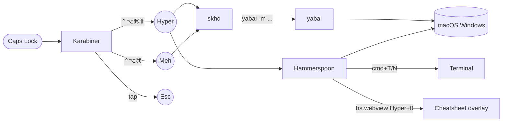

# Architecture

How a single Caps Lock keystroke becomes a window-focus command, in five
layers.

## Layer stack



Plain English: **Caps Lock** is intercepted by Karabiner-Elements, which
re-emits one of three things depending on what's held with it. **skhd** and
**Hammerspoon** listen for those re-emitted modifier sets and trigger
shortcuts that drive **yabai** (window tiler) and terminal apps.

## The two Hyper levels

Both are emitted by Karabiner from the same Caps Lock key.

| User presses | Karabiner emits | Modifier set | Used by |
|---|---|---|---|
| Caps Lock alone (tap) | `Escape` | — | Vim, dialogs |
| Caps Lock held | **Hyper** | `⌃⌥⌘⇧` (4) | `Hyper+H/J/K/L` etc. |
| Caps Lock + Shift held | **Meh** | `⌃⌥⌘` (3, Shift consumed) | `Hyper+Shift+H/J/K/L` etc. |

**Why two levels?** If Hyper itself contained Shift, then "Hyper + Shift + H"
would collapse to "Hyper + H" because Shift would already be set. By making
Caps+Shift emit a *different* combo (Meh), skhd can bind them as separate
shortcuts. See `configs/karabiner.md` for the JSON specifics.

## Who owns what

| Concern | Owner | Config |
|---|---|---|
| Caps Lock remap (Hyper, Meh, Esc) | Karabiner-Elements | `configs/karabiner.json` |
| Window tiling (BSP, gaps, rules) | yabai | `configs/yabairc` |
| Hyper window-management hotkeys | skhd | `configs/skhdrc` |
| Hyper terminal hotkeys (T, N) | Hammerspoon | `configs/hammerspoon-init.lua` |
| Hyper SIP-safe window snaps (arrows) | Hammerspoon | `configs/hammerspoon-init.lua` |
| Cheatsheet overlay (Hyper+0) | Hammerspoon | `configs/hammerspoon-cheatsheet.lua` |
| tmux pane navigation | tmux | `configs/tmux.conf` |
| Neovim leader bindings | nvim | `configs/nvim-keymaps.lua` (drop-in) |

## Why skhd AND Hammerspoon?

They're complementary, not redundant.

- **skhd** is the fast, low-level binder. It uses macOS's `CGEventTap` to
  catch keystrokes system-wide and forwards them to yabai. Very fast, very
  reliable. But it can only invoke external commands — it doesn't have an
  API for "send Cmd+T to whatever terminal app the user prefers."
- **Hammerspoon** is a Lua-scripted automation tool. We use it for the
  things that need *logic*: "find the user's terminal app, activate it, send
  Cmd+T" (Hyper+T). Also for the HTML cheatsheet overlay, the SIP-safe
  window snaps, and any future smart hotkey.

## TCC permission gates

Each of these is a per-user, per-app permission that macOS gates behind the
System Settings UI. The wizard chains the user through them in order. See
`docs/wizard.md` for the full flow.

| Permission | Apps that need it | Probe |
|---|---|---|
| Accessibility | yabai, skhd, Hammerspoon, Karabiner-Elements | `launchctl list` for service liveness; `hs.accessibilityState()` for HS; TCC.db read or `Karabiner-Core-Service-rev2` agent liveness for Karabiner |
| Input Monitoring | Karabiner-Elements, Karabiner-DriverKit | TCC.db read; behavioral fallback (service is running) |
| System Extension approval | Karabiner-DriverKit-VirtualHIDDevice | `systemextensionsctl list \| grep 'activated enabled'` |
| Mission Control "separate Spaces" | yabai | `defaults read com.apple.spaces spans-displays` must be `0`; **logout required to apply** |
| sudo (one-shot) | brew cask installers (`installer -pkg`) | `sudo -v` at start of bootstrap |

The Karabiner accessibility / input monitoring probes use **TCC.db SQLite
reads** when Terminal has Full Disk Access, otherwise fall back to "is
Karabiner-Core-Service-rev2 running?" — the service refuses to start
without both grants, so a live PID is strong behavioral evidence.

## File map

```
~/dotfiles/
├── bootstrap.sh              # OS dispatcher → macos/ or ubuntu/
├── lib/
│   ├── common.sh            # log/warn/err/have/has_tty/backup/install_file
│   └── macos-tcc.sh         # TCC.db reads + per-app permission probes
├── macos/
│   ├── bootstrap.sh         # brew + casks + configs + defaults + wizard call
│   └── permissions-wizard.sh # proactive permission chaining (--step <name>)
├── ubuntu/
│   └── bootstrap.sh         # apt + chezmoi + mise + Docker + Claude CLI
├── configs/                  # source-of-truth dotfiles (text + Lua + JSON)
└── docs/
    ├── architecture.md      # this file
    └── wizard.md            # permission wizard reference
```

Source-of-truth principle: **all configs live in `configs/`**. The bootstrap
copies them into place, comparing byte-for-byte and skipping no-ops. Edits
should always start in `configs/`, then re-run the bootstrap (or the
specific deploy helper) to propagate.
