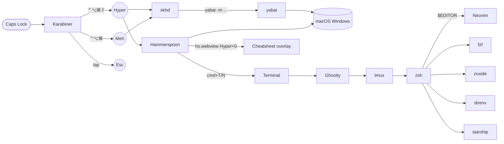

# Architecture

How a single Caps Lock keystroke becomes a window-focus command — and how
the same key turns the rest of the keyboard into a coherent dev surface.

## Layer stack



In one paragraph: **Caps Lock** is intercepted by Karabiner, which re-emits
one of three things depending on what's held with it. **skhd** and
**Hammerspoon** listen for those re-emitted modifier sets and trigger
shortcuts that drive **yabai** (window tiler) and the terminal. Inside the
terminal, **tmux** + **zsh** + **Neovim** form the dev surface — every
layer reusing the same vim-style hjkl + leader-key mental model.

## The two Hyper levels

Both are emitted by Karabiner from the same Caps Lock key.

| User presses | Karabiner emits | Modifier set | Used by |
|---|---|---|---|
| Caps Lock alone (tap) | `Escape` | — | Vim, dialogs |
| Caps Lock held | **Hyper** | `⌃⌥⌘⇧` (4) | `Hyper+H/J/K/L` etc. |
| Caps Lock + Shift held | **Meh** | `⌃⌥⌘` (3, Shift consumed) | `Hyper+Shift+H/J/K/L` etc. |

**Why two levels?** If Hyper itself contained Shift, then "Hyper + Shift + H"
would collapse to "Hyper + H" because Shift would already be set. By making
Caps+Shift emit a *different* combo (Meh), skhd can bind them as separate
shortcuts. See `configs/karabiner.md` for the JSON specifics.

## Who owns what

| Concern | Owner | Config |
|---|---|---|
| Caps Lock remap (Hyper, Meh, Esc) | Karabiner-Elements | `configs/karabiner.json` |
| Window tiling (BSP, gaps, rules) | yabai | `configs/yabairc` |
| Hyper window-management hotkeys | skhd | `configs/skhdrc` |
| Hyper terminal hotkeys (T, N) | Hammerspoon | `configs/hammerspoon-init.lua` |
| Hyper SIP-safe window snaps (arrows) | Hammerspoon | `configs/hammerspoon-init.lua` |
| Cheatsheet overlay (Hyper+0) | Hammerspoon | `configs/hammerspoon-cheatsheet.lua` |
| Terminal app config (Option-as-Meta) | Ghostty | `configs/ghostty-config` |
| tmux pane navigation, sessionizer | tmux | `configs/tmux.conf` + `configs/tmux-sessionizer` |
| Shell: vi-mode, fzf, zoxide, direnv, starship | zsh | `configs/zshrc` |
| Code search defaults | ripgrep | `configs/ripgreprc` |
| Git pager + structural settings | git + delta | `configs/gitconfig` |
| Editor: plugins, LSP, DAP, tests | Neovim + Lazy + Mason | `configs/nvim-init.lua` |
| Plugin version pinning across machines | lazy.nvim | `configs/nvim-lazy-lock.json` |

## Why skhd AND Hammerspoon?

They're complementary, not redundant.

- **skhd** is the fast, low-level binder. It uses macOS's `CGEventTap` to
  catch keystrokes system-wide and forwards them to yabai. Very fast, very
  reliable. But it can only invoke external commands — it doesn't have an
  API for "send Cmd+T to whatever terminal app the user prefers."
- **Hammerspoon** is a Lua-scripted automation tool. We use it for things
  that need *logic*: "find the user's terminal app, activate it, send
  Cmd+T" (Hyper+T). Also for the HTML cheatsheet overlay, the SIP-safe
  window snaps, and any future smart hotkey.

## In-terminal layers

Once you're in the terminal, the same hjkl + leader-key model continues:

| Layer | Prefix / leader | What it owns |
|---|---|---|
| **tmux** | `C-Space` | Pane focus (`hjkl`), splits (`v`/`s`), zoom (`z`), fzf project picker (`f`), windows (`c`/`n`/`p`/`0..9`) |
| **zsh** | (vi-mode `Esc`) | Vi-style normal-mode editing on the command line; fzf widgets on `Ctrl-R` / `Ctrl-T` / `Alt-C`; zoxide `z <pat>` |
| **Neovim** | `Space` | LSP (`gd`/`K`/`gr`/`<leader>ca`/`<leader>rn`), find (`<leader>f*`), debug (`<leader>d*`), test (`<leader>t*`) |

The reason this works: **modifier sets the scope**. A bare `h` moves the
cursor in vim. `C-Space + h` moves the tmux pane focus. `Caps + h` moves
the OS window focus. The same letter, four different contexts, no overlap.

## Python dev path

Out of the box after bootstrap:

1. Open any `.py` file in nvim.
2. **Pyright** (types, definitions, hover) and **Ruff** (lint, format) attach.
3. Save the file → Ruff auto-formats via the LSP `BufWritePre` autocmd.
4. `<leader>db` to set a breakpoint, `<leader>tn` to run the nearest test.
5. `<leader>td` runs the nearest test under the debugger (debugpy).
6. `<leader>ts` toggles the neotest summary panel.

All servers (Pyright, Ruff, debugpy) come from Mason / mason-tool-installer,
pinned via `lazy-lock.json` so two machines stay in lockstep.

## TCC permission gates

Each of these is a per-user, per-app permission that macOS gates behind the
System Settings UI. The wizard chains the user through them in order. See
`docs/wizard.md` for the full flow.

| Permission | Apps that need it | Probe |
|---|---|---|
| Accessibility | yabai, skhd, Hammerspoon, Karabiner-Elements | `launchctl list` for service liveness; `hs.accessibilityState()` for HS; TCC.db read or `Karabiner-Core-Service-rev2` agent liveness for Karabiner |
| Input Monitoring | Karabiner-Elements, Karabiner-DriverKit | TCC.db read; behavioral fallback (service is running) |
| System Extension approval | Karabiner-DriverKit-VirtualHIDDevice | `systemextensionsctl list \| grep 'activated enabled'` |
| Mission Control "separate Spaces" | yabai | `defaults read com.apple.spaces spans-displays` must be `0`; **logout required to apply** |
| sudo (one-shot) | brew cask installers (`installer -pkg`) | `sudo -v` at start of bootstrap |

The Karabiner accessibility / input monitoring probes use **TCC.db SQLite
reads** when Terminal has Full Disk Access, otherwise fall back to "is
Karabiner-Core-Service-rev2 running?" — the service refuses to start
without both grants, so a live PID is strong behavioral evidence.

## File map

```
~/dotfiles/
├── bootstrap.sh                  # OS dispatcher → macos/ or ubuntu/
├── lib/
│   ├── common.sh                 # logging (banner/section/step/ok/warn/err) + install_file
│   └── macos-tcc.sh              # TCC.db reads + per-app permission probes
├── macos/
│   ├── bootstrap.sh              # 5 phases: sudo / packages / configs / defaults / wizard
│   └── permissions-wizard.sh     # 3 phases: register / grant / summary  (--step <name>)
├── ubuntu/
│   └── bootstrap.sh              # 6 phases: system / chezmoi / shell / runtimes / configs / shell
├── configs/                      # source-of-truth dotfiles (text + Lua + JSON)
│   ├── karabiner.{json,md}       # JSON config + companion explainer
│   ├── yabairc · skhdrc          # window tiling + Hyper bindings
│   ├── hammerspoon-{init,cheatsheet}.lua
│   ├── ghostty-config
│   ├── tmux.conf · tmux-sessionizer
│   ├── zshrc · gitconfig · ripgreprc
│   └── nvim-{init.lua,lazy-lock.json,keymaps.lua}
└── docs/
    ├── architecture.md           # this file
    └── wizard.md                 # permission wizard reference
```

Source-of-truth principle: **all configs live in `configs/`**. The bootstrap
copies them into place, comparing byte-for-byte and skipping no-ops. Edits
should always start in `configs/`, then re-run the bootstrap (or just save
the file in place — for Hammerspoon, the watcher reloads automatically).
