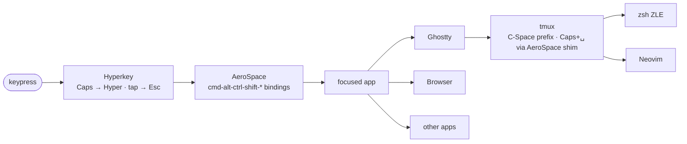

# Keymap

Reference data: every bound chord, who owns it, where to edit, what collides.
Narrative & rationale live in [architecture.md](architecture.md); this file is
the inventory + collision map.

## TL;DR

- Stack: hardware → **Hyperkey** → **AeroSpace** → app (Ghostty / browser / …) → tmux → zsh / nvim.
- Caps Lock: **tap = Esc** · **hold = Hyper** (`⌃⌥⌘⇧`).
- One layer (Hyper). No separate Mod layer — Hyperkey can't reproduce
  Karabiner's Caps+Shift→Mod swallow, so the swap chords moved to
  Caps+yuio instead of Caps+Shift+hjkl. Two-layer history lives in
  `docs/archive/yabai-to-aerospace.md`.
- Source of truth lives in `configs/`. Apply edits by re-running
  `./macos/bootstrap.sh` — idempotent.

## Precedence chain



Four governing rules:

1. **Hyperkey only sees Caps Lock.** All other keys pass through.
   Caps held → emits `⌃⌥⌘⇧`; Caps tapped → emits `Escape`. There is no
   per-key remapping or per-modifier disambiguation — that's why the
   swap layer can't ride on Caps+Shift+hjkl any more.
2. **AeroSpace grabs `cmd-alt-ctrl-shift-*` chords**, system-wide. Hyper
   bindings beat any in-app shortcut on the same physical key.
3. **Inside a terminal, tmux's `C-Space` prefix is bound BEFORE the
   shell sees the key.** User-facing chord is **Caps+Space** — AeroSpace
   grabs `cmd-alt-ctrl-shift-space` and runs `tmux send-keys C-Space`
   (IPC, not synthetic keystrokes). zsh/nvim bindings only fire on
   non-prefixed keys, or *after* the prefix dispatches.
4. **`set -sg escape-time 10` in [tmux.conf:65](../configs/tmux.conf:65)
   is load-bearing.** Protects Caps-tap-Esc from being interpreted as an
   Option chord in Ghostty.

## Hyperkey

Hyperkey ([raycast/leap/hyperkey](https://github.com/raycast/hyperkey))
is the Caps-Lock remapper. Config lives in user defaults; the cask
installs an .app you launch once and grant Accessibility to. There's no
file in `configs/` — bootstrap seeds the defaults via:

```sh
defaults write com.knollsoft.Hyperkey enableHyperKey -bool true
defaults write com.knollsoft.Hyperkey tapForEscape   -bool true
```

| Input | Output |
|---|---|
| Caps held alone | `⌃⌥⌘⇧` (Hyper) |
| Caps tapped (no other key) | `Escape` |

What Hyperkey **can't** do (vs Karabiner): a separate Caps+Shift layer
with Shift consumed. Anything that needs distinguish-Caps-vs-Caps+Shift
has to use different keys, not different modifiers.

## AeroSpace

[`configs/aerospace.toml`](../configs/aerospace.toml). `hyper` = `cmd-alt-ctrl-shift`.

### Focus / swap / snap (direction-aware)

| Chord | Action | aerospace.toml |
|---|---|---|
| Caps + h/j/k/l | `ws-dir` — *floating*: snap h/l = halves · j = center · k = fill; *tiled*: `aerospace focus left/down/up/right` | (hand-owned binding) |
| Caps + y/u/i/o | `aerospace move left/down/up/right` (swap; was Caps+Shift+hjkl pre-Hyperkey) | (hand-owned binding) |

### Layout / float

| Chord | Action | aerospace.toml |
|---|---|---|
| Caps + v | toggle floating ↔ tiling on the focused window | (hand-owned binding) |
| Caps + r | flatten + rotate workspace tree 90° | (hand-owned binding) |

### Workspace cycle

| Chord | Action | aerospace.toml |
|---|---|---|
| Caps + n | previous workspace (wraps) — `ws-focus prev` | (hand-owned binding) |
| Caps + p | next workspace (wraps) — `ws-focus next` | (hand-owned binding) |
| Caps + Tab | last/recent workspace — `ws-focus last` (→ `aerospace workspace-back-and-forth`) | (hand-owned binding) |

n/p ordering is positional on QWERTY: P sits right of N → "next = right" matches forward-motion intuition.

### Workspace digits (sigil-generated)

| Chord | Action | Source |
|---|---|---|
| Caps + 1..9, 0 | focus workspace by name (slot N → first N workspaces in spaces.json order) | sentinel-fenced block; regenerate with `ws-topology emit-aerospace --write` |

Send-window-to-workspace digit chords are intentionally **not bound** —
under Hyperkey, Caps+Shift+N collapses onto Caps+N (same modifier set
once Hyper consumes all four modifiers), so they can't share the digit
row. Use **Caps + g** (ws-prompt send) to send a window to a specific
workspace.

### Workspace prompts (SwiftUI overlays)

Four overlays, one pattern: **digit commits · letters fuzzy-search · ↵
accepts · esc cancels**. Pick by intent — change to *jump* to a window's
space, focus to *land* on a space, go to *send* a window, edit to
*modify* the space set.

| Chord | Action | aerospace.toml |
|---|---|---|
| Caps + e | change workspace (`ws-picker`) — fuzzy-search every window in every space; ↵ jumps to that window's workspace | (hand-owned binding) |
| Caps + f | focus workspace (`ws-prompt focus`) — digit / fuzzy name | (hand-owned binding) |
| Caps + g | go / send window (`ws-prompt send`) — digit / fuzzy name, follows window | (hand-owned binding) |
| Caps + m | go / send window — alias for Caps+g ("m for move") | (hand-owned binding) |
| Caps + w | edit workspace (`ws-prompt manage`) — rename / icon / color / verify / doctor. **Add/destroy are config-time** under aerospace; the overlay surfaces an edit-then-reload help message. | (hand-owned binding) |
| Caps + / | cheatsheet toggle (`ws-cheatsheet`) | (hand-owned binding) |

### Launchers

Letters earn first-letter mnemonics; the rest live on the right-pinky
punctuation cluster so the left pinky (holding Caps) doesn't have to
take its hand off the home row mid-chord. App launchers route through
helpers under `~/.local/bin/`; env-var overrides mean swapping a tool
is a one-file change, not a key-map edit.

| Chord | Action | Helper |
|---|---|---|
| Caps + t | new terminal window | `ws-launch-terminal` · `$WS_TERMINAL_APP` |
| Caps + b | new browser window | `ws-launch-browser` · `$WS_BROWSER_APP` |
| Caps + . | new Finder window | inline AppleScript |
| Caps + ; | notes (Raycast Notes → Apple Notes) | `ws-launch-notes` · `$WS_NOTES_APP` |
| Caps + ' | writing (Obsidian vault → Apple Notes) | `ws-launch-inbox` · `$WS_INBOX_APP` · `$WS_INBOX_VAULT` |
| Caps + , | System Settings | inline `open -a` |
| Caps + / | cheatsheet HUD (toggle) | `ws-cheatsheet --toggle` |

## AeroSpace state (adjacent to bindings)

[`configs/aerospace.toml`](../configs/aerospace.toml) — not key
bindings, but state that affects what the chords do.

| Concern | Section | Notes |
|---|---|---|
| Outer gap = 26pt at top | `[gaps]` | Reserves the strip sketchybar lives in. Changing it without also moving sketchybar's bar height clips the bar against the top window. |
| Float rules | `[[on-window-detected]]` | These apps float by default — Caps+v on them does nothing useful. |
| Workspace declarations | `[workspace-to-monitor-force-assignment]` | Workspaces are declared statically; runtime add/destroy isn't supported. Edit + `aerospace reload-config`. **TODO**: `ws-topology` still ships only `emit-skhd`, not `emit-aerospace` — so the sigil-fenced digit-binding block in aerospace.toml is currently empty and **Caps+1..0 do nothing**. Fix-path is either landing `emit-aerospace` in sigil or hand-writing the ten `cmd-alt-ctrl-shift-N = 'workspace N'` lines. |
| `exec-on-workspace-change` | inside sigil-fenced block | Replaces yabai's `space_changed` signal — primes `~/.cache/workspace/current.env` for tmux + starship. |

## Ghostty

[`configs/ghostty-config`](../configs/ghostty-config).

| Chord | Action | Where |
|---|---|---|
| Cmd + T | `new_window` (overrides macOS's default new-tab) | [:18](../configs/ghostty-config:18) |
| Cmd + N | `new_window` (matches Cmd+T for muscle-memory parity) | [:19](../configs/ghostty-config:19) |
| Option | left only behaves as Alt (`macos-option-as-alt = left`) | [:5](../configs/ghostty-config:5) |

## tmux

[`configs/tmux.conf`](../configs/tmux.conf) — prefix is `C-Space`, but
you don't press it directly. AeroSpace binds `cmd-alt-ctrl-shift-space`
to `tmux send-keys C-Space`, so the user-facing chord is **Caps+Space**
(matching the yabai/Karabiner-era muscle memory). `tmux send-keys` is
IPC, not synthetic keystroke injection, so the Hyper modifiers don't
contaminate the prefix. All bindings have `-N "..."` notes, surfaced
by `tmux list-keys -N`.

| Chord | Action | tmux.conf |
|---|---|---|
| `Caps+␣` | prefix (was `C-b` → `C-Space` → `C-a` → `C-Space`) | [:34](../configs/tmux.conf:34) |
| `Caps+␣  Caps+␣` | send literal `C-Space` (e.g. nvim cmp completion) | [:35](../configs/tmux.conf:35) |
| `Caps+␣  h/j/k/l` | select pane W/S/N/E | (see "Pane nav") |
| `Caps+␣  v` / `s` | split right / below | (see "Splits") |
| `Caps+␣  |` / `-` | split right / below (visual aliases) | (see "Splits") |
| `Caps+␣  z` | zoom pane (toggle) | |
| `Caps+␣  d` | detach session | |
| `Caps+␣  r` | reload tmux.conf | |
| `Caps+␣  x` | kill pane (no confirm) | |
| `Caps+␣  &` | kill window (no confirm) | |
| `Caps+␣  f` | tmux-sessionizer fzf popup | |

Gotcha: no `Option/M-*` bindings, intentionally — see the comment at
[tmux.conf:8](../configs/tmux.conf:8). Adding one risks colliding with
Ghostty's left-Alt key bytes.

The shim is a one-liner in
[aerospace.toml](../configs/aerospace.toml) — search for
`cmd-alt-ctrl-shift-space`. Hardcoded `/opt/homebrew/bin/tmux` because
AeroSpace runs under launchd with a minimal PATH; update if the brew
prefix ever changes. Literal `C-Space` (Ctrl+Space directly) still
works as a fallback if the shim ever stops grabbing.

## zsh

[`configs/zshrc`](../configs/zshrc) — vi-mode + fzf widgets + zoxide.

| Chord | Action | Source |
|---|---|---|
| `bindkey -v` | enable vi mode | [zshrc:6](../configs/zshrc:6) |
| `Esc` (in insert mode) | enter vi normal | vi-mode |
| `Ctrl-R` / `Ctrl-T` / `Alt-C` | fzf history / file-picker / cd | [`~/.fzf.zsh`](../configs/zshrc:27) |
| `z <pat>` | zoxide jump | [zshrc:53](../configs/zshrc:53) |

Note: vi-mode binds happen *first* so fzf/autosuggest pick up the right
keymap ([zshrc:4–5 comment](../configs/zshrc:4)).

## Neovim

[`configs/nvim-init.lua`](../configs/nvim-init.lua) +
[`configs/nvim-keymaps.lua`](../configs/nvim-keymaps.lua). Leader = Space
([init.lua:13–14](../configs/nvim-init.lua:13)). The nvim-side layout
didn't move with the Hyperkey/AeroSpace migration — sections below are
unchanged from the yabai era.

### LSP (unprefixed)

| Chord | Action |
|---|---|
| `gd` | go to definition |
| `gr` | go to references |
| `K` | hover docs |

### `<leader>c*` code · `<leader>f*` find · `<leader>g*` git · `<leader>h*` harpoon

See [nvim-init.lua](../configs/nvim-init.lua) for the full mapping
tables — every action has its own `:map`-discoverable line, no surprises.

## Collision matrix

Cross-layer conflicts that already exist + how they're resolved.

| Apparent collision | Resolution |
|---|---|
| `Caps + 1..0` (workspace focus) vs `Caps + Shift + 1..0` (the yabai-era "send window to N") | Both collapse onto the same chord under Hyperkey — Hyper consumes all four modifiers, so Shift is a no-op once Caps is held. Send-window digit chords are not bound under aerospace; use Caps + g (ws-prompt send) instead. **Note: focus-digit chords are also currently unbound** — see the sigil-fenced block TODO above. |
| `Caps + T` (terminal launch) vs Ghostty `Cmd + T` (new_window) | Different modifier sets; both fire in their own contexts. |
| Caps-tap-Esc vs Ghostty option-as-alt | `escape-time 10` gives the ESC byte time to arrive; "no Option/M-* bindings" in tmux prevents the ambiguity from mattering. |
| zsh vi-mode `Esc` vs Caps-tap-Esc | Same key — Caps-tap IS the canonical way to enter vi normal mode. |
| nvim `<C-Space>` (cmp complete) vs tmux prefix `C-Space` | Both want the same chord. AeroSpace's Caps+Space shim sends `C-Space` to tmux first; literal Ctrl+Space inside nvim still reaches cmp because the shim only fires on Hyper-modified Space, not bare Ctrl+Space. To send a literal `C-Space` *through* tmux to the inner program, double-tap Caps+Space (mirrors the old `C-a C-a` send-prefix pattern). |
| **Held-Caps + injected `Cmd+X`** in a launcher | Synthetic keystrokes pick up the live Hyper modifier state — `Cmd+N` becomes `Hyper+N` when Caps is still held, firing the workspace cycle. Fix: use `click menu item …` (AX API, bypasses AeroSpace) or pick a letter unbound at Hyper. `ws-doctor` lints for this. |

## Free-key register

Per layer, what's currently unbound and safe to claim. Always re-verify
before adding a binding — plugins can shadow defaults.

- **Hyper-level free** (sweep of aerospace.toml's `[mode.main.binding]`):
  most punctuation and a handful of letters. Verify with
  `grep -E '^cmd-alt-ctrl-shift-<key>[[:space:]]*=' ~/.config/aerospace/aerospace.toml`.
- **tmux prefix free**: most letters not in `h/j/k/l/v/s/|/-/z/d/r/x/f/[`.
  Verify with `tmux list-keys -T prefix`.
- **nvim leader free**: most letters not under `f/g/h/d/t/b/c/r/=` + `1..4`.
  Verify with `:WhichKey <leader>` (or `:map <leader>X` for one prefix).

## Editing protocol

"I want to bind X to Y" — five steps.

1. **Pick the layer** by what fires the action:
   - OS-level (focus window, launch app, edit workspace) → aerospace.toml
     `[mode.main.binding]` (`cmd-alt-ctrl-shift-X = '…'`).
   - App launcher with auto-detect logic → bash helper in
     `configs/workspace/launch-*.sh` + 1 line in aerospace.toml.
   - tmux-multiplexer scope → `tmux.conf` `bind-key`.
   - Shell editing → `zshrc` `bindkey`.
   - Editor scope → `nvim-init.lua` (plugin config) or
     `nvim-keymaps.lua` (cross-cutting).
2. **Check collisions:**
   - aerospace: `grep -nE 'cmd-alt-ctrl-shift-<key>[[:space:]]*=' configs/aerospace.toml`
   - tmux: `tmux list-keys -N | grep ' <key> '`
   - nvim: `:map <chord>` (or `:WhichKey <leader>x`)
3. **Edit the file** under `configs/`. Follow existing conventions
   (aerospace.toml's `# >>> sigil generated >>>` fences own the digit
   block; tmux's `-N "..."` notes; etc.).
4. **Apply.** `./macos/bootstrap.sh` is the canonical apply path —
   idempotent. To iterate faster on one layer:
   - aerospace: `aerospace reload-config` (also: relaunch AeroSpace.app)
   - tmux: `prefix r` (or `tmux source-file ~/.tmux.conf`)
   - Hyperkey: quit + relaunch from the menu bar
   - nvim: `:Lazy reload <plugin>` or restart
5. **Verify.** Fire the chord. If it's an OS chord, also confirm it
   doesn't leak into the focused app. Then run `ws-doctor` — it checks
   aerospace freshness, source/deploy drift, keystroke-injection
   collisions, menu-item resolution, and aerospace app-name casing.

## Things that will bite you

Failure modes that have actually shipped in this stack. `ws-doctor` checks
all of them — run it before declaring a keymap change done.

- **Stale aerospace.toml.** `aerospace reload-config` does a re-read;
  `ps` still shows the original .app launch time. If a chord does
  nothing, the toml may have been edited without a reload. Reload is
  idempotent and cheap.
- **Keystroke contamination.** Any `osascript ... keystroke "X" using ...`
  in a launcher fires *as Hyper+X* if the user is still holding Caps
  when it runs. If Hyper+X is bound, the wrong action fires. Mitigations,
  in order of preference: (a) drive the app via `click menu item` (AX
  call, bypasses aerospace entirely); (b) drive it via the app's
  AppleScript dictionary (`make new window`); (c) pick a letter that's
  unbound at Hyper.
- **Source / deploy drift.** `configs/workspace/launch-*.sh` is *copied*
  to `~/.local/bin/ws-launch-*` by bootstrap. Patching only one side
  either reverts the fix on next bootstrap or leaves the running system
  stale. Always edit `configs/` and re-run bootstrap (or copy both).
- **Menu item renamed by upstream.** `click menu item "New Window"`
  fails silently if a release renames the item. `ws-doctor menu-items`
  resolves every reference against the live app's menu tree.
- **AeroSpace `app-name` casing.** `aerospace list-windows --all --json`
  reports the process name, which can diverge from the Finder display
  name. Filters that exact-match on `.app == "X"` fail silently. Prefer
  case-insensitive compare or fix the case.
- **AeroSpace monitor ordinal isn't stable.** AeroSpace numbers monitors
  1..N by an internal ordering that can drift on hot-plug. Sigil keys
  spaces.json on the CG-stable `CGDisplayCreateUUIDFromDisplayID` UUID
  for this reason — never rely on aerospace's ordinal across hot-plug.

## File index

Every file referenced above, with role + runtime path.

| Source-of-truth | Runtime install | Role |
|---|---|---|
| (none — Hyperkey is .app-only) | `/Applications/Hyperkey.app` + user defaults | Caps remap |
| [configs/aerospace.toml](../configs/aerospace.toml) | `~/.config/aerospace/aerospace.toml` | Window manager + chord dispatch (sentinel-fenced) |
| [configs/ghostty-config](../configs/ghostty-config) | `~/.config/ghostty/config` | Terminal hotkeys |
| [configs/tmux.conf](../configs/tmux.conf) | `~/.tmux.conf` | Multiplexer prefix + binds |
| [configs/zshrc](../configs/zshrc) | `~/.zshrc` | Shell ZLE + fzf + zoxide |
| [configs/nvim-init.lua](../configs/nvim-init.lua) | `~/.config/nvim/init.lua` | Editor leader + LSP |
| [configs/nvim-keymaps.lua](../configs/nvim-keymaps.lua) | `~/.config/nvim/lua/keymaps.lua` | Editor cross-cutting maps |
| [configs/workspace/launch-terminal.sh](../configs/workspace/launch-terminal.sh) | `~/.local/bin/ws-launch-terminal` | Auto-detect terminal launcher |
| [configs/workspace/launch-browser.sh](../configs/workspace/launch-browser.sh) | `~/.local/bin/ws-launch-browser` | Auto-detect browser launcher |
| [configs/workspace/launch-notes.sh](../configs/workspace/launch-notes.sh) | `~/.local/bin/ws-launch-notes` | Notes launcher (Raycast → Apple) |
| [configs/workspace/launch-inbox.sh](../configs/workspace/launch-inbox.sh) | `~/.local/bin/ws-launch-inbox` | Inbox launcher (Obsidian → Apple) |
| [sigil/Sources/ws-prompt/](https://github.com/adames/sigil/tree/main/Sources/ws-prompt) | `~/.local/bin/ws-prompt` | Focus / send / manage overlay |
| [sigil/Sources/ws-picker/](https://github.com/adames/sigil/tree/main/Sources/ws-picker) | `~/.local/bin/ws-picker` | Window picker overlay |
| [sigil/Sources/ws-cheatsheet/](https://github.com/adames/sigil/tree/main/Sources/ws-cheatsheet) | `~/.local/bin/ws-cheatsheet` | Cheatsheet HUD |
| [configs/workspace/cheatsheet.json](../configs/workspace/cheatsheet.json) | `~/.config/workspace/cheatsheet.json` | Cheatsheet HUD content |
| [macos/bootstrap.sh](../macos/bootstrap.sh) | (run directly) | Idempotent apply path |
| [bin/ws-doctor](../bin/ws-doctor) | `~/.local/bin/ws-doctor` | Keymap / launcher health check |
