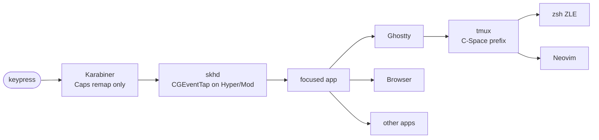

# Keymap

Reference data: every bound chord, who owns it, where to edit, what collides.
Narrative & rationale live in [architecture.md](architecture.md); this file is
the inventory + collision map.

## TL;DR

- Stack: hardware → Karabiner → skhd → app (Ghostty / browser / …) → tmux → zsh / nvim.
- Caps Lock: **tap = Esc** · **hold = Hyper** (`⌃⌥⌘⇧`) · **+ Shift = Mod** (`⌃⌥⌘`, Shift consumed).
- Layer rule: **Hyper navigates · Mod modifies.**
- Source of truth lives in `configs/`. Apply edits by re-running `./macos/bootstrap.sh` — idempotent.

## Precedence chain

Four governing rules:

1. **Karabiner only sees Caps Lock.** All other keys pass through. Caps+Shift→Mod
   rule must precede Caps→Hyper in [`karabiner.json`](../configs/karabiner.json) —
   load order is load-bearing (the Hyper rule otherwise consumes Caps+Shift first).
2. **skhd grabs Hyper/Mod chords via CGEventTap**, system-wide. Hyper bindings
   beat any in-app shortcut on the same physical key.
3. **Inside a terminal, tmux's `C-Space` prefix is bound BEFORE the shell sees
   the key.** zsh/nvim bindings only fire on non-prefixed keys, or *after* the
   prefix dispatches.
4. **`set -sg escape-time 10` in [tmux.conf:51](../configs/tmux.conf:51) is load-bearing.**
   Protects Caps-tap-Esc from being interpreted as an Option chord in Ghostty.

## Karabiner

`configs/karabiner.json` — only Caps Lock is remapped. Two rules; the second
must follow the first.

| Input | Output | Where |
|---|---|---|
| Caps + Shift | `⌃⌥⌘` (Mod) | [karabiner.json:17–32](../configs/karabiner.json:17) |
| Caps held alone | `⌃⌥⌘⇧` (Hyper) | [karabiner.json:35–53](../configs/karabiner.json:35) |
| Caps tapped (no other key) | `Escape` | [karabiner.json:49–50](../configs/karabiner.json:49) |

Narrative & free-key register: [`configs/karabiner.md`](../configs/karabiner.md).

## skhd

[`configs/skhdrc`](../configs/skhdrc). `hyper` = `cmd+alt+ctrl+shift`. `mod` = `cmd+alt+ctrl`.

### Focus / swap

| Chord | Action | skhdrc |
|---|---|---|
| Caps + h/j/k/l | `yabai -m window --focus west/south/north/east` | [:9–12](../configs/skhdrc:9) |
| Caps + Shift + h/j/k/l | `yabai -m window --swap west/south/north/east` | [:14–17](../configs/skhdrc:14) |

### Layout / float

| Chord | Action | skhdrc |
|---|---|---|
| Caps + v | toggle float on the focused window | [:28](../configs/skhdrc:28) |
| Caps + Shift + v | center floating window (`--grid 4:4:1:1:2:2`) | [:29](../configs/skhdrc:29) |
| Caps + r | rotate BSP layout 90° | [:30](../configs/skhdrc:30) |
| Caps + Shift + r | rebalance BSP grid (`--balance`) | [:31](../configs/skhdrc:31) |
| Caps + e | expose / window picker (`ws-picker`) | [:32](../configs/skhdrc:32) |

### Workspace cycle

| Chord | Action | skhdrc |
|---|---|---|
| Caps + n | next workspace (wraps) — `ws-focus next` | [:39](../configs/skhdrc:39) |
| Caps + p | previous workspace (wraps) — `ws-focus prev` | [:40](../configs/skhdrc:40) |
| Caps + Tab | last/recent workspace — `ws-focus last` (→ `yabai --focus recent`) | [:41](../configs/skhdrc:41) |

### Workspace prompts (SwiftUI overlays)

| Chord | Action | skhdrc |
|---|---|---|
| Caps + w | focus prompt — digit / fuzzy name | [:61](../configs/skhdrc:61) |
| Caps + g | send prompt — digit / fuzzy name, follows window | [:62](../configs/skhdrc:62) |
| Caps + m | send prompt — alias for Caps+g ("m for move") | [:66](../configs/skhdrc:66) |
| Caps + Shift + w | manage prompt — add / rename / icon / destroy / layout / verify / doctor | [:67](../configs/skhdrc:67) |
| Caps + Esc | no-op (muscle-memory preservation; chord must not leak) | [:68](../configs/skhdrc:68) |
| Caps + ; | cheatsheet toggle (`ws-cheatsheet`) — key code `0x29` | [:74](../configs/skhdrc:74) |

### Launchers

All app launchers go through helpers under `~/.local/bin/`. Env-var overrides
mean swapping a tool is a one-file change, not a key-map edit.

| Chord | Action | skhdrc | Helper |
|---|---|---|---|
| Caps + t | new terminal window | [:88](../configs/skhdrc:88) | [`ws-launch-terminal`](../configs/workspace/launch-terminal.sh) · `$WS_TERMINAL_APP` |
| Caps + b | new browser window | [:89](../configs/skhdrc:89) | [`ws-launch-browser`](../configs/workspace/launch-browser.sh) · `$WS_BROWSER_APP` |
| Caps + o | new Finder window | [:90](../configs/skhdrc:90) | inline AppleScript |
| Caps + , | System Settings — key code `0x2B` | [:91](../configs/skhdrc:91) | inline `open -a` |
| Caps + q | notes (Raycast Notes → Apple Notes) | [:92](../configs/skhdrc:92) | [`ws-launch-notes`](../configs/workspace/launch-notes.sh) · `$WS_NOTES_APP` |
| Caps + Shift + q | inbox (Obsidian vault → Apple Notes) | [:93](../configs/skhdrc:93) | [`ws-launch-inbox`](../configs/workspace/launch-inbox.sh) · `$WS_INBOX_APP` · `$WS_INBOX_VAULT` |

## yabai

[`configs/yabairc`](../configs/yabairc) — not key bindings, but adjacent state
that affects what the skhd chords do.

| Concern | Where | Notes |
|---|---|---|
| Mouse modifier | [:31–34](../configs/yabairc:31) | `fn` + drag to move/resize a window |
| Management-disable rules | [:42–62](../configs/yabairc:42) | These apps float by default — Caps+v on them does nothing useful |
| `window_created` signal | [:81–84](../configs/yabairc:81) | → `stage-window.sh` (cross-space migrate, focus, center floats) |
| `space_changed` signal | [:97–100](../configs/yabairc:97) | → `on-space-changed.sh` (cascade entry) |
| `display_changed` signal | [:114–117](../configs/yabairc:114) | → SketchyBar refresh |
| `space_created` / `space_destroyed` | [:148–154](../configs/yabairc:148) | → SketchyBar pill refresh |

## Ghostty

[`configs/ghostty-config`](../configs/ghostty-config).

| Chord | Action | Where |
|---|---|---|
| Cmd + T | `new_window` (overrides macOS's default new-tab) | [:18](../configs/ghostty-config:18) |
| Cmd + N | `new_window` (matches Cmd+T for muscle-memory parity) | [:19](../configs/ghostty-config:19) |
| Option | left only behaves as Alt (`macos-option-as-alt = left`) | [:5](../configs/ghostty-config:5) |

## tmux

[`configs/tmux.conf`](../configs/tmux.conf) — prefix is `C-Space`. All bindings
have `-N "..."` notes, surfaced by `tmux list-keys -N`.

| Chord | Action | tmux.conf |
|---|---|---|
| `C-Space` | prefix (was `C-b`, then `C-a`) | [:18](../configs/tmux.conf:18) |
| `C-Space  C-Space` | send literal `C-Space` (e.g. nvim cmp completion) | [:19](../configs/tmux.conf:19) |
| `C-Space  h/j/k/l` | select pane W/S/N/E | [:22–25](../configs/tmux.conf:22) |
| `C-Space  v` / `s` | split right / below | [:28–29](../configs/tmux.conf:28) |
| `C-Space  |` / `-` | split right / below (visual aliases) | [:30–31](../configs/tmux.conf:30) |
| `C-Space  z` | zoom pane (toggle) | [:33](../configs/tmux.conf:33) |
| `C-Space  d` | detach session | [:34](../configs/tmux.conf:34) |
| `C-Space  r` | reload tmux.conf | [:35](../configs/tmux.conf:35) |
| `C-Space  x` | kill pane (no confirm) | [:40](../configs/tmux.conf:40) |
| `C-Space  &` | kill window (no confirm) | [:41](../configs/tmux.conf:41) |
| `C-Space  f` | tmux-sessionizer fzf popup | [:44](../configs/tmux.conf:44) |

Gotcha: no `Option/M-*` bindings, intentionally — see the comment at
[tmux.conf:9–12](../configs/tmux.conf:9). Adding one risks colliding with
Ghostty's left-Alt key bytes.

## zsh

[`configs/zshrc`](../configs/zshrc) — vi-mode + fzf widgets + zoxide.

| Chord | Action | Source |
|---|---|---|
| `bindkey -v` | enable vi mode | [zshrc:6](../configs/zshrc:6) |
| `Esc` (in insert mode) | enter vi normal | vi-mode |
| `Ctrl-R` / `Ctrl-T` / `Alt-C` | fzf history / file-picker / cd | [`~/.fzf.zsh`](../configs/zshrc:27) |
| `z <pat>` | zoxide jump | [zshrc:53](../configs/zshrc:53) |

Note: vi-mode binds happen *first* so fzf/autosuggest pick up the right keymap
([zshrc:4–5 comment](../configs/zshrc:4)).

## Neovim

[`configs/nvim-init.lua`](../configs/nvim-init.lua) + [`configs/nvim-keymaps.lua`](../configs/nvim-keymaps.lua).
Leader = Space ([init.lua:13–14](../configs/nvim-init.lua:13)).

### LSP (unprefixed)

| Chord | Action | init.lua |
|---|---|---|
| `gd` | go to definition | [:74](../configs/nvim-init.lua:74) |
| `gr` | go to references | [:75](../configs/nvim-init.lua:75) |
| `K` | hover docs | [:76](../configs/nvim-init.lua:76) |

### `<leader>c*` code

| Chord | Action | init.lua |
|---|---|---|
| `<leader>ca` | code action | [:77](../configs/nvim-init.lua:77) |
| `<leader>rn` | rename symbol | [:78](../configs/nvim-init.lua:78) |
| `<leader>=` | format buffer | [:79](../configs/nvim-init.lua:79) |

### Insert-mode cmp

`<C-b>` / `<C-f>` / `<C-Space>` / `<C-e>` / `<CR>` / `<Tab>` / `<S-Tab>` — see
[init.lua:104–119](../configs/nvim-init.lua:104).

### `<leader>f*` find · `]c`/`[c` hunk nav

| Chord | Action | init.lua |
|---|---|---|
| `<leader>ff` | files | [:131](../configs/nvim-init.lua:131) |
| `<leader>fg` | live grep | [:132](../configs/nvim-init.lua:132) |
| `<leader>fb` | buffers | [:133](../configs/nvim-init.lua:133) |
| `]c` / `[c` | next / prev hunk | [:144–149](../configs/nvim-init.lua:144) |

### `<leader>g*` git

| Chord | Action | init.lua |
|---|---|---|
| `<leader>gh` / `gp` / `gr` | stage hunk / preview / reset | [:150–158](../configs/nvim-init.lua:150) |
| `<leader>gb` | blame line | (same range) |
| `<leader>gd` | diff buffer | (same range) |
| `<leader>gs` | status (fzf picker) | (same range) |

### `<leader>h*` harpoon · `<leader>1..4`

| Chord | Action | init.lua |
|---|---|---|
| `<leader>ha` | add file | [:171](../configs/nvim-init.lua:171) |
| `<leader>hh` | toggle quick menu | [:172](../configs/nvim-init.lua:172) |
| `<leader>1..4` | jump to pinned slot | [:173–176](../configs/nvim-init.lua:173) |

### Oil · `-`

| Chord | Action | init.lua |
|---|---|---|
| `-` | open parent dir (oil) | [:188](../configs/nvim-init.lua:188) |

### `<leader>d*` debug · `<leader>t*` test

| Chord | Action | init.lua |
|---|---|---|
| `<leader>db/dc/do/di/du/dr/dx/dU` | break/continue/over/into/out/repl/terminate/UI | [:235–242](../configs/nvim-init.lua:235) |
| `<leader>tn/tf/tl/ts/to/td` | nearest/file/last/summary/output/debug | [:263–268](../configs/nvim-init.lua:263) |

### `<leader>b*` buffer

| Chord | Action | nvim-keymaps.lua |
|---|---|---|
| `<leader>bn/bp` | next/prev buffer | [:10–17](../configs/nvim-keymaps.lua:10) |
| `<leader>bd` | delete current buffer | (same range) |
| `<leader>bo` | close other buffers | (same range) |

## Collision matrix

Cross-layer conflicts that already exist + how they're resolved.

| Apparent collision | Resolution | Source |
|---|---|---|
| `Caps + Space` (Hyper+Space) vs tmux `C-Space` prefix | Resolved by Karabiner rule #1: Hyper+Space → Ctrl+Space, so both Caps+Space and physical Ctrl+Space fire the prefix. Don't bind Hyper+Space in skhd — Karabiner consumes it first. | [karabiner.json:16](../configs/karabiner.json:16) |
| `Caps + T` (terminal launch) vs Ghostty `Cmd + T` (new_window) | Different modifier sets; both fire in their own contexts. | skhdrc:80, ghostty-config:18 |
| Caps-tap-Esc vs Ghostty option-as-alt | `escape-time 10` gives the ESC byte time to arrive; "no Option/M-* bindings" in tmux prevents the ambiguity from mattering. | [tmux.conf:9–12, 51](../configs/tmux.conf:9) |
| zsh vi-mode `Esc` vs Caps-tap-Esc | Same key — Caps-tap IS the canonical way to enter vi normal mode. | [zshrc:6](../configs/zshrc:6) |
| nvim `<C-Space>` (cmp complete) vs tmux prefix `C-Space` | tmux grabs first; use `prefix → C-Space` ([tmux.conf:19](../configs/tmux.conf:19)) to send a literal `C-Space` to nvim. | tmux.conf:19 |
| Caps + Esc → no-op | By design — muscle-memory preservation; chord must not leak into focused app. | [karabiner.md:105](../configs/karabiner.md:105), [skhdrc:68](../configs/skhdrc:68) |
| **Caps + /** (workspace help, historical) | **Retired.** The key code never reliably fired on this machine — long-standing skhd / hardware quirk, not worth debugging. Use Caps + ; instead. | [skhdrc:71–73](../configs/skhdrc:71) |

## Free-key register

Per layer, what's currently unbound and safe to claim. Always re-verify before
adding a binding — plugins can shadow defaults.

- **Hyper-level free** (per [karabiner.md:75–76](../configs/karabiner.md:75) + sweep of skhdrc): `c`, `m`, `space`, most punctuation. Verify with `grep -E 'cmd \+ alt \+ ctrl \+ shift - <key>' configs/skhdrc`.
- **Mod-level free** (everything except `hjkl`, `v`, `r`, `w`, `q`): most letters + punctuation. Verify with `grep -E 'cmd \+ alt \+ ctrl - <key>' configs/skhdrc`.
- **tmux prefix free**: most letters not in `h/j/k/l/v/s/|/-/z/d/r/x/f/[`. Verify with `tmux list-keys -T prefix`.
- **nvim leader free**: most letters not under `f/g/h/d/t/b/c/r/=` + `1..4`. Verify with `:WhichKey <leader>` (or `:map <leader>X` for one prefix).

## Editing protocol

"I want to bind X to Y" — five steps.

1. **Pick the layer** by what fires the action:
   - OS-level (focus window, launch app, manage workspace) → skhd (`hyper - X` or `mod - X`).
   - App launcher with auto-detect logic → bash helper in `configs/workspace/launch-*.sh` + 1 line in `macos/bootstrap.sh`.
   - tmux-multiplexer scope → `tmux.conf` `bind-key`.
   - Shell editing → `zshrc` `bindkey`.
   - Editor scope → `nvim-init.lua` (plugin config) or `nvim-keymaps.lua` (cross-cutting).
2. **Check collisions:**
   - skhd: `grep -nE '(cmd \+ alt \+ ctrl( \+ shift)?) - <key>' configs/skhdrc`
   - tmux: `tmux list-keys -N | grep ' <key> '`
   - nvim: `:map <chord>` (or `:WhichKey <leader>x`)
3. **Edit the file** under `configs/`. Follow existing conventions (skhd's
   `# --- section ---` headers, tmux's `-N "..."` notes).
4. **Apply.** `./macos/bootstrap.sh` is the canonical apply path — idempotent.
   To iterate faster on one layer:
   - skhd: `skhd --restart-service`
   - tmux: `prefix r` (or `tmux source-file ~/.tmux.conf`)
   - yabai: `yabai --restart-service`
   - Karabiner: live reload (file watcher in Karabiner-Elements)
   - nvim: `:Lazy reload <plugin>` or restart
5. **Verify.** Fire the chord. If it's an OS chord, also confirm it doesn't
   leak into the focused app (the Caps+Esc no-op rule).

## File index

Every file referenced above, with role + runtime path.

| Source-of-truth | Runtime install | Role |
|---|---|---|
| [configs/karabiner.json](../configs/karabiner.json) | `~/.config/karabiner/karabiner.json` | Caps remap |
| [configs/karabiner.md](../configs/karabiner.md) | (n/a — doc) | Karabiner JSON narrative + free-key register |
| [configs/skhdrc](../configs/skhdrc) | `~/.skhdrc` | Hyper/Mod chord dispatch |
| [configs/yabairc](../configs/yabairc) | `~/.yabairc` | yabai tiling + signals |
| [configs/ghostty-config](../configs/ghostty-config) | `~/.config/ghostty/config` | Terminal hotkeys |
| [configs/tmux.conf](../configs/tmux.conf) | `~/.tmux.conf` | Multiplexer prefix + binds |
| [configs/zshrc](../configs/zshrc) | `~/.zshrc` | Shell ZLE + fzf + zoxide |
| [configs/nvim-init.lua](../configs/nvim-init.lua) | `~/.config/nvim/init.lua` | Editor leader + LSP |
| [configs/nvim-keymaps.lua](../configs/nvim-keymaps.lua) | `~/.config/nvim/lua/keymaps.lua` | Editor cross-cutting maps |
| [configs/workspace/launch-terminal.sh](../configs/workspace/launch-terminal.sh) | `~/.local/bin/ws-launch-terminal` | Auto-detect terminal launcher |
| [configs/workspace/launch-browser.sh](../configs/workspace/launch-browser.sh) | `~/.local/bin/ws-launch-browser` | Auto-detect browser launcher |
| [configs/workspace/launch-notes.sh](../configs/workspace/launch-notes.sh) | `~/.local/bin/ws-launch-notes` | Notes launcher (Raycast → Apple) |
| [configs/workspace/launch-inbox.sh](../configs/workspace/launch-inbox.sh) | `~/.local/bin/ws-launch-inbox` | Inbox launcher (Obsidian → Apple) |
| [configs/workspace/cli/ws-focus](../configs/workspace/cli/ws-focus) | `~/.local/bin/ws-focus` | Workspace cycle (next/prev/last) |
| [configs/workspace/topology/Sources/ws-prompt/](../configs/workspace/topology/Sources/ws-prompt/) | `~/.local/bin/ws-prompt` | Focus / send / manage overlay |
| [configs/workspace/topology/Sources/ws-picker/](../configs/workspace/topology/Sources/ws-picker/) | `~/.local/bin/ws-picker` | Window picker overlay |
| [configs/workspace/topology/Sources/ws-cheatsheet/](../configs/workspace/topology/Sources/ws-cheatsheet/) | `~/.local/bin/ws-cheatsheet` | Cheatsheet HUD |
| [configs/workspace/cheatsheet.json](../configs/workspace/cheatsheet.json) | `~/.config/workspace/cheatsheet.json` | Cheatsheet HUD content |
| [macos/bootstrap.sh](../macos/bootstrap.sh) | (run directly) | Idempotent apply path |
